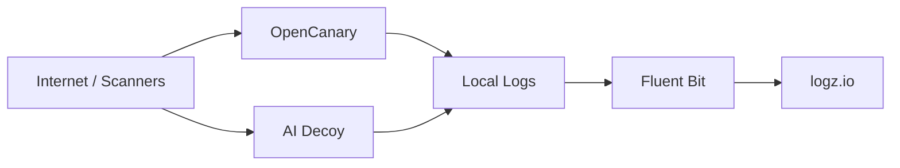

# Agents-IA-Honeypot


High-interaction decoy lab for threat intelligence classes, focused on:
- classic protocol scanning with `OpenCanary`
- AI tooling exposure mapping with `ai-decoy`
- centralized audit pipeline with `Fluent Bit -> logz.io`

## Language

- Portugues (PT-BR): [`README.pt-BR.md`](README.pt-BR.md)
- English (EN): [`README.en.md`](README.en.md)

## Architecture



## Highlights

| Area | Value |
|---|---|
| Decoy protocols | HTTP, SSH, FTP, Telnet, SMTP, POP3, IMAP, MySQL, PostgreSQL, RDP |
| AI decoy targets | n8n, OpenClaw, Open WebUI, Ollama, Gradio, Jupyter, Flowise, AnythingLLM |
| Audit output | Structured JSON logs + forwarding to `logz.io` |
| Teaching fit | Great for reconnaissance mapping and attacker behavior analysis |

## Deploy on VPS / Dedicated Server (one-liner)

```bash
curl -sSL https://raw.githubusercontent.com/andersonvalentim/AI-HONEYPOT/main/setup.sh | sudo bash
```

The script will:
- Install Docker if needed
- Clone the repository to `/opt/ai-honeypot`
- Ask for port mode (standard vs high ports)
- Configure logz.io token interactively
- Handle SSH port conflict on port 22
- Offer to open firewall ports (ufw)
- Build and start all containers

## Quick Start (Local with Docker Compose)

```bash
cp .env.example .env
docker compose up -d --build
docker compose logs -f
```

## Deploy on Railway

1. Fork or push this repo to GitHub
2. Go to [railway.app](https://railway.app) and create a new project
3. Select **"Deploy from GitHub repo"** and choose this repository
4. Railway will auto-detect the `Dockerfile` via `railway.toml`
5. In the Railway dashboard, add environment variables:
   - `LOGZIO_TOKEN` (required)
   - `LOGZIO_LISTENER_HOST` (default: `listener.logz.io`)
   - `LOGZIO_LISTENER_PORT` (default: `8071`)
   - `HONEYPOT_ENV` (default: `railway`)
6. After deploy, go to **Settings > Networking** and enable **TCP Proxy** for the ports you want exposed:

| Service | Internal Port | Protocol |
|---|---|---|
| HTTP (OpenCanary) | 18080 | TCP |
| SSH | 10022 | TCP |
| FTP | 10021 | TCP |
| Telnet | 10023 | TCP |
| SMTP | 10025 | TCP |
| POP3 | 10110 | TCP |
| IMAP | 10143 | TCP |
| MySQL | 13306 | TCP |
| RDP | 13389 | TCP |
| PostgreSQL | 15432 | TCP |
| n8n (decoy) | 5678 | TCP |
| OpenClaw (decoy) | 3000 | TCP |
| Open WebUI (decoy) | 3001 | TCP |
| Ollama (decoy) | 11434 | TCP |
| Gradio (decoy) | 7860 | TCP |
| Jupyter (decoy) | 8888 | TCP |
| Flowise (decoy) | 8080 | TCP |
| AnythingLLM (decoy) | 9000 | TCP |

Railway will assign a public `hostname:port` for each TCP proxy.

## EasyPanel Ready

Use `docker-compose.easypanel.yml` for non-privileged external ports, reducing conflicts when deploying through EasyPanel.

## Security Notice

> Run this project only in isolated lab environments.
>
> - Use dedicated VLAN / segmented network
> - Never deploy to production
> - Never use real credentials or sensitive data
> - Enforce outbound monitoring and egress control
