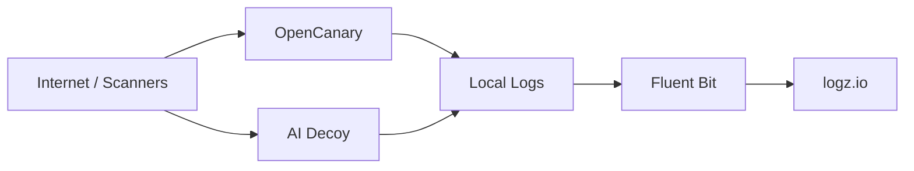

# Agents-IA-Honeypot


High-interaction decoy lab for threat intelligence classes, focused on:
- classic protocol scanning with `OpenCanary`
- AI tooling exposure mapping with `ai-decoy`
- centralized audit pipeline with `Fluent Bit -> logz.io`

## Language

- Portugues (PT-BR): [`README.pt-BR.md`](README.pt-BR.md)
- English (EN): [`README.en.md`](README.en.md)

## Architecture



## Highlights

| Area | Value |
|---|---|
| Decoy protocols | HTTP, SSH, FTP, Telnet, SMTP, POP3, IMAP, MySQL, PostgreSQL, RDP |
| AI decoy targets | n8n, OpenClaw, Open WebUI, Ollama, Gradio, Jupyter, Flowise, AnythingLLM |
| Audit output | Structured JSON logs + forwarding to `logz.io` |
| Teaching fit | Great for reconnaissance mapping and attacker behavior analysis |

## Quick Start

```bash
cp .env.example .env
docker compose up -d --build
docker compose logs -f opencanary
docker compose logs -f ai-decoy
docker compose logs -f fluent-bit
```

## EasyPanel Ready

Use `docker-compose.easypanel.yml` for non-privileged external ports (example: `18080`, `10022`, `15678`, `21434`), reducing conflicts when deploying through EasyPanel.

## Security Notice

> Run this project only in isolated lab environments.
>
> - Use dedicated VLAN / segmented network
> - Never deploy to production
> - Never use real credentials or sensitive data
> - Enforce outbound monitoring and egress control
